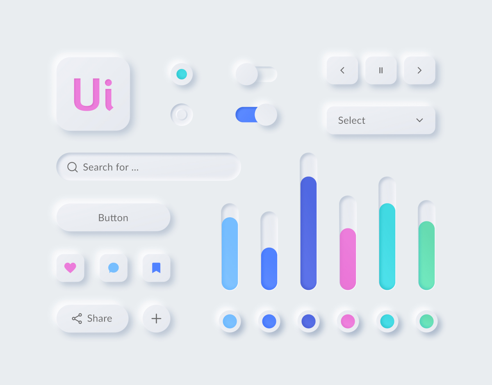

# Soft Touch UI
A React component library implementing Neumorphic design concepts.  

**Please note the library is under active development, so we don't recommend using it for production at the moment.**

## Authors
- [Tatsiana Charnysh](https://github.com/TatsianaCharnysh) (design)
- [Konstantin Komelin](https://github.com/kkomelin) (development)

## License & Copyright
[MIT License](https://github.com/kkomelin/soft-touch-ui/blob/master/LICENSE) © 2020 Konstantin Komelin and Tatsiana Charnysh
